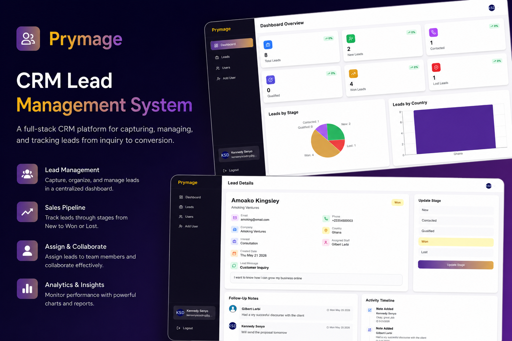
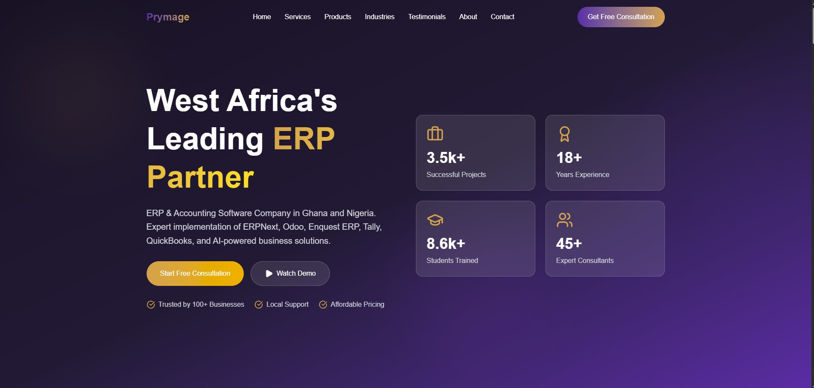
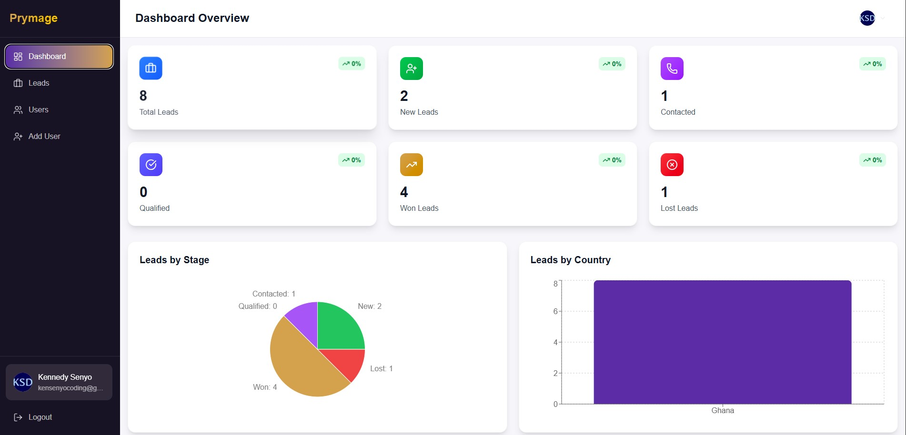
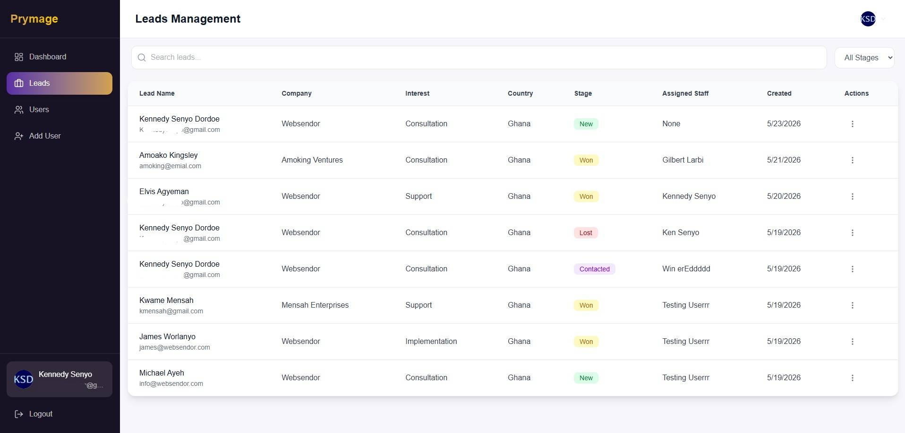
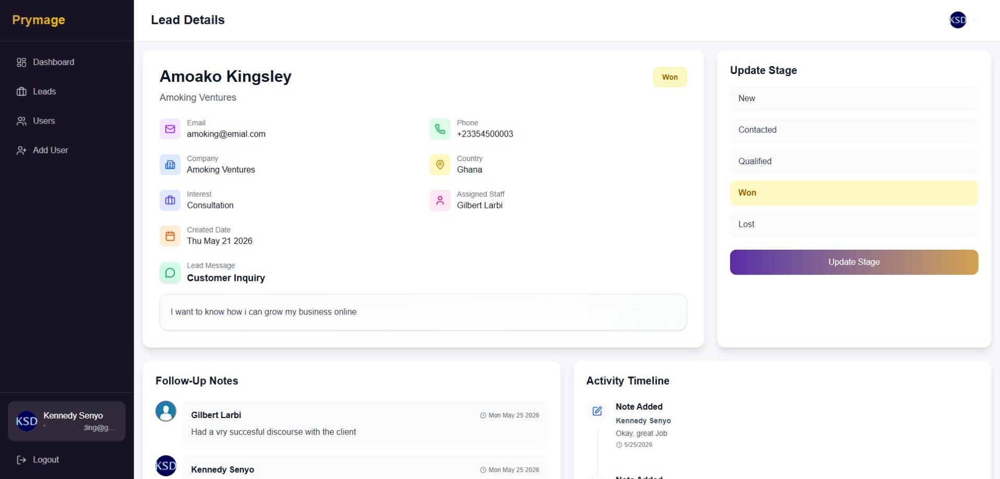
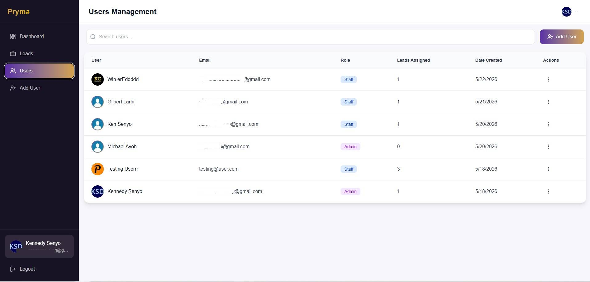
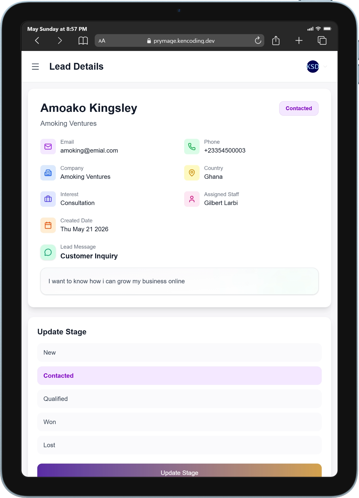

# CRM Lead Management System

A full-stack **CRM Lead Management Platform** built with Next.js for managing customer inquiries, sales pipelines, staff assignments, and follow-up workflows.

The system helps businesses capture leads from their website, assign them to staff members, track progress through multiple sales stages, and monitor team performance through dashboards and analytics.


## Live Demo

Try the application here:

🔗 [https://prymage.kencoding.dev/admin/dashboard](https://prymage.kencoding.dev/admin/dashboard)

### Demo Account

Use the following credentials to explore the application:

Email: [testing@user.com](testing@user.com)  
Password: testing1234

---

## Features

- Lead capture directly from the company website
- CRM dashboard for managing customer inquiries
- Role-based authentication for Admin and Staff users
- Lead assignment system
- Lead stage management:
  - New
  - Contacted
  - Qualified
  - Won
  - Lost
- Follow-up notes and activity tracking
- User management system
- Dashboard analytics and reporting
- Monthly performance charts
- Responsive UI for desktop and mobile
- Form validation using Zod
- Rate limiting and bot protection using Arcjet
- Email notifications for onboarding and lead activities

---

## Tech Stack

### Frontend

- Next.js
- React
- TypeScript
- Tailwind CSS
- shadcn/ui
- Radix UI
- Recharts

### Backend

- Next.js Server Actions
- Next.js Route Handlers
- Drizzle ORM

### Database

- PostgreSQL

### Authentication & Security

- Better Auth
- Arcjet
- Zod Validation

---

## How It Works

The CRM system captures leads submitted through a company landing page or consultation form.

When a visitor submits the form:

- the lead is stored in the database
- administrators can assign the lead to staff members
- staff members can update the lead stage
- notes and follow-up activities are recorded
- dashboards update analytics automatically

The system helps businesses centralize lead management and track customer interactions throughout the sales process.

---

## Why I Built It

I built this project to practice designing and developing a real-world business application with modern full-stack technologies.

The goal was to create a production-style CRM system that combines:

- authentication
- database relationships
- dashboards
- role management
- analytics
- secure backend workflows
- responsive UI architecture

Through this project, I gained experience working with scalable backend logic, relational database design, reusable UI systems, and business-focused workflows.

---

## Screenshots

### Landing Page



### CRM Dashboard



### Leads Management



### Lead Details



### User Management



### Mobile View



---

## Getting Started

Clone the repository:

```bash
git clone https://github.com/Kennedysenyo/prymage.git
```

Navigate into the project directory:

```bash
cd prymage
```

Install dependencies:

```bash
npm install
```

Create your environment variables:

```bash
cp .env.example .env
```

Fill in the required environment variables in your `.env` file.

Run the development server:

```bash
npm run dev
```

Then open:

```txt
http://localhost:3000
```

---

## Project Structure

```txt
src
│
├── app            # Next.js App Router pages and routes
├── components     # Reusable UI components
├── features       # Feature-based business logic
├── db             # Database schema and queries
├── lib            # Utilities and shared logic
├── emails         # Email templates
├── types          # Shared TypeScript types
```

---

## System Architecture

The application uses a feature-based architecture with separated frontend and backend responsibilities.

### Lead Flow

1. User submits consultation form
2. Lead is stored in PostgreSQL
3. Admin assigns lead to a staff member
4. Staff updates lead stages
5. Notes and activities are tracked
6. Dashboard analytics update automatically

### Database Design

The system uses relational database models for:

- users
- leads
- lead notes
- lead stage history

This structure allows efficient querying, reporting, and activity tracking.

---

## Technical Highlights

- Built with Next.js App Router and Server Actions
- Uses Drizzle ORM for type-safe database queries
- Implements role-based authentication and authorization
- Includes optimistic UI updates for better UX
- Uses reusable dashboard and form components
- Tracks lead history and user activities
- Implements secure rate limiting and bot protection
- Fully responsive across desktop and mobile devices

---

## Contributing

Contributions are welcome. Feel free to fork the repository and submit a pull request.

---

## Author

Kennedy Senyo Dordoe

GitHub: https://github.com/kennedysenyo
